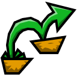
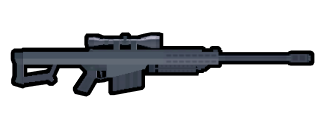

> [!NOTE]
> As [Soldat 2 has officially reached end of development](https://store.steampowered.com/news/app/474220/view/4656249009454303927?l=english), this repository is archived and will no longer be maintained.

# Soldat 2 custom image assets

This is a collection of custom assets related to Soldat 2 &ndash; like ranks, weapons and mode icons.

Each image in here has the same outline width: 4 pixels. This was done to ensure having a clean outline when resized down to 32 px height, while also serving a 2&times; and 4&times; versions to devices with high resolution screens.

Most of these images are used on my [Soldat 2 Active Players website](https://oczki.pl/s2-players), which allows checking the player activity on public servers and in official ranked matches.

You can [**download everything in this repository** as a single zip file](https://github.com/oczki/soldat2-assets/archive/refs/heads/main.zip).

---

## Gamemodes

Each image is **128&times;128 px**.

Original images by me, drawn in Figma as vectors. Let me know if you need these without outlines or in some higher resolution.

These are not used anywhere in the game, only on S2-Players website.

### Some examples

- Team Deathmatch  
  &nbsp;
  

- Climb  
  &nbsp;
  

- Domination + Survival  
  &nbsp;
  

---

## Ranks

Each image is **128&times;128 px**.

Original images were made by proto; I got permission to upload these here as derivative work.

I've modified some shapes, darkened the stripes and enlarged them &ndash; so that the ranks are **more distinguishable when resized down**.

Ranks within each group (e.g. Gold I, Gold II, Gold III) are aligned to each other.

### Some examples

- Silver III  
  &nbsp;
  

- Platinum II  
  &nbsp;
  

- Champion II  
  &nbsp;
  

---

## Room 7158's ranks

Original images by me, drawn in Figma as vectors. The directory contains SVGs and **512&times;512 px** PNGs.

Drawn to be easily recognizable as their assigned rank (from 1 to 8) even at very small sizes, and on both light and dark themes.

Used on the community-driven ranked system, called Room 7158.

### All icons
 
&nbsp;
&nbsp;
&nbsp;
&nbsp;
&nbsp;
&nbsp;
&nbsp;
&nbsp;

---

## Weapons

Each image is **328&times;128 px**.

Most of the original images were taken from the game and sent to me by darDar. Melee and N/A were traced by me in Figma.

I've cleaned up the edges, recolored the bodies, fixed some details, and added outlines that also cover up the jagged edges. There are also flat versions, which are a bit thinner (no outline) and have a solid black fill.

All weapons face right.

### Some examples

- Barrett  
  &nbsp;
  &nbsp;
  

- Rocket Launcher  
  &nbsp;
  &nbsp;
  

- Melee  
  &nbsp;
  &nbsp;
  
